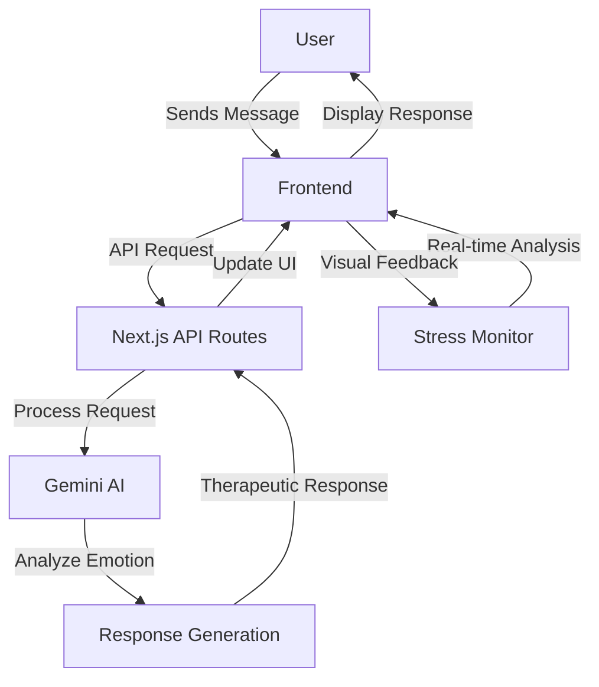

# AI Therapist

[](https://opensource.org/licenses/Apache-2.0)

A modern, AI-powered therapeutic chat application that provides mental health support through natural conversations. Built with Next.js and powered by Gemini AI, this application offers a safe space for users to express their thoughts and receive supportive responses.

[Live Demo](https://ai-therapist-black.vercel.app/) | [GitHub Repository](https://github.com/pranav271103/ai-therapist.git)

## Features

- AI-powered therapeutic conversations
- Real-time stress level monitoring
- Privacy-focused design
- Dark mode support
- Built with Next.js and TypeScript
- Modern, responsive UI with Tailwind CSS

## Tech Stack

- **Frontend**: Next.js, TypeScript, Tailwind CSS
- **AI**: Gemini AI for natural language processing
- **Backend**: Next.js API Routes
- **Deployment**: Vercel

## Installation

1. Clone the repository:
   ```bash
   git clone https://github.com/pranav271103/ai-therapist.git
   cd ai-therapist
   ```

2. Install dependencies:
   ```bash
   npm install
   # or
   yarn
   # or
   pnpm install
   ```

3. Set up environment variables:
   Create a `.env.local` file in the root directory and add your Gemini API key:
   ```
   NEXT_PUBLIC_GEMINI_API_KEY=your_gemini_api_key_here
   ```

4. Run the development server:
   ```bash
   npm run dev
   # or
   yarn dev
   # or
   pnpm dev
   ```

5. Open [http://localhost:3000](http://localhost:3000) in your browser.

## Deployment

This project is configured for deployment on Vercel. To deploy your own instance:

1. Fork this repository
2. Create a new Vercel project and import your forked repository
3. Add your Gemini API key as an environment variable
4. Deploy!

## System Architecture



## License

This project is licensed under the Apache License 2.0 - see the [LICENSE](LICENSE) file for details.

## Contributing

Contributions are welcome! Please feel free to submit a Pull Request.

1. Fork the Project
2. Create your Feature Branch (`git checkout -b feature/AmazingFeature`)
3. Commit your Changes (`git commit -m 'Add some AmazingFeature'`)
4. Push to the Branch (`git push origin feature/AmazingFeature`)
5. Open a Pull Request

## Contact

Pranav - [GitHub](https://github.com/pranav271103)

## Acknowledgments

- [Next.js](https://nextjs.org/)
- [Gemini AI](https://ai.google.dev/)
- [Tailwind CSS](https://tailwindcss.com/)
- [Vercel](https://vercel.com/)

---
